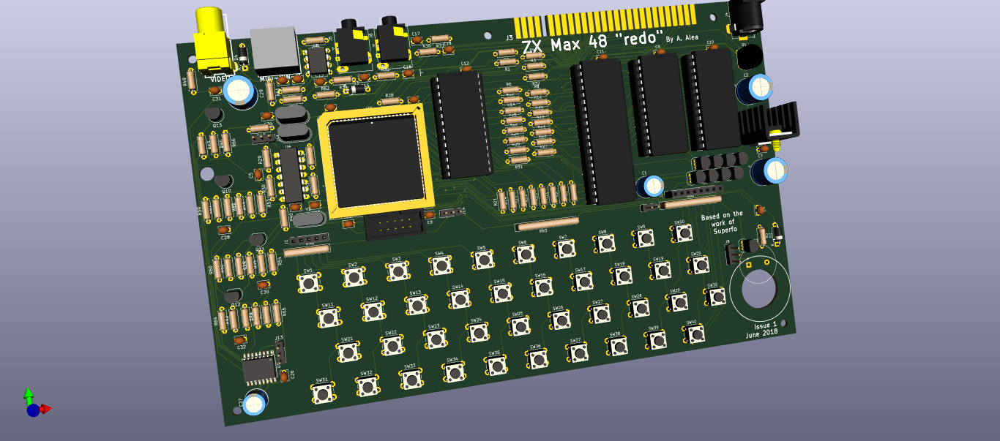
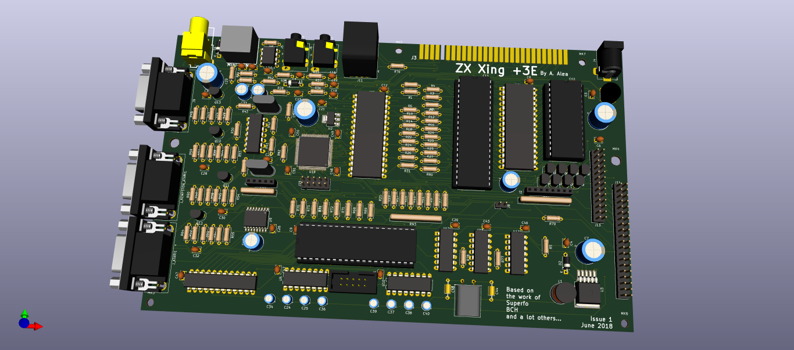

# Esquema electrico en Kicad de Clones de Sinclair ZX Spectrum

La idea es que a base de borrar trozos de circuito que no interese, generemos nuestro propio clon
personalizado con las siguientes opciones:
 
* ULA - Elegir entre ALTERA o XILING
* MEMORIA RAM- 48 o 128K de RAM
* MEMORIA ROM- 16K o 64K ROM, opciones de ROM mayores con seleccion por dip-switches
* SONIDO - PSG (AY-3-8912 o YM2114), MONO O ABC, OPCION puertos SERIE, AUX
* CINTA - conectores 48K o +3, circuiteria tipo Arlequin o tipo Humble
* VIDEO - RGB o Composite, circuiteria tipo Arlequin
* JOYSTICK - SJS o ATARI, normas SINCLAIR o KEMPSTON
* TECLADO - integrado de 40 Teclas, por transistores (arlequin) o diodos
* TECLADO - conexion facil para teclas externas, DEL, BREAK, CURSORES, BLOQ SHIFT, EXTRA, GRAF
* DISCO - Conexion para interfaz multisistema de wilco (compatible +3), interfaz +D o Interfaz +3
* ALMACENAMIENTO - Interfaz IDE de 8bits, Cartucho IF2, dandanator integrado o con cartuchos VC2.0 

## Futuro:
* DISCO - beta 128, ZXMMC, DIVIDE
* MEMORIA - Usar los 256K tipo ruso
* VIDEO - conector euroconector
* ULA - por chips del arlequin
* IMPRESORA - amstrad / kempston
* RATON - kempston db9, kempston ps2

## Ejemplos:

